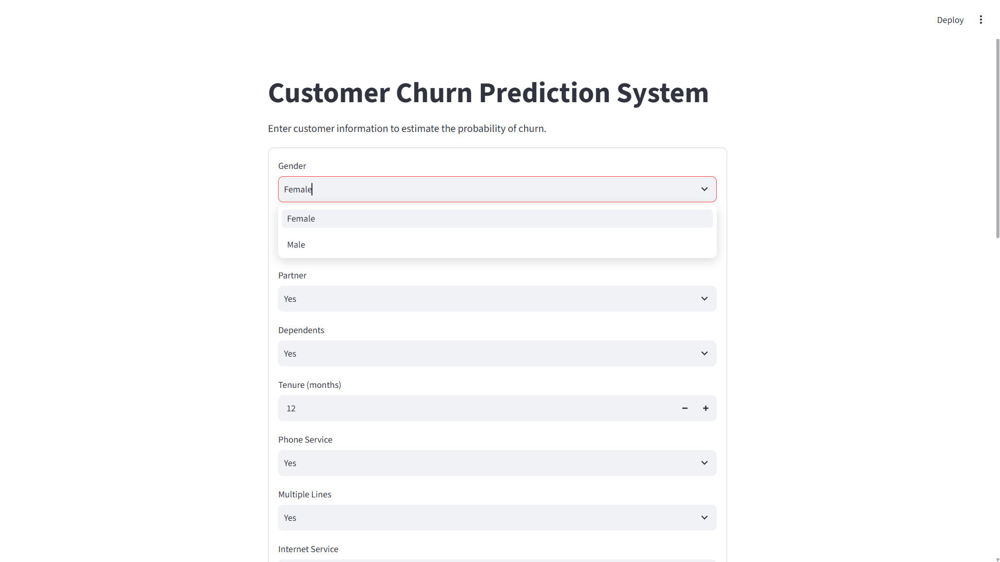
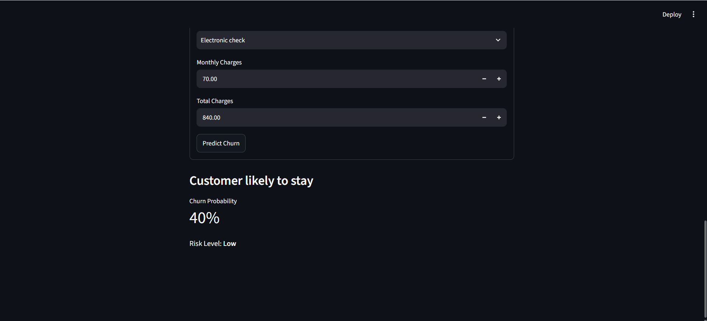
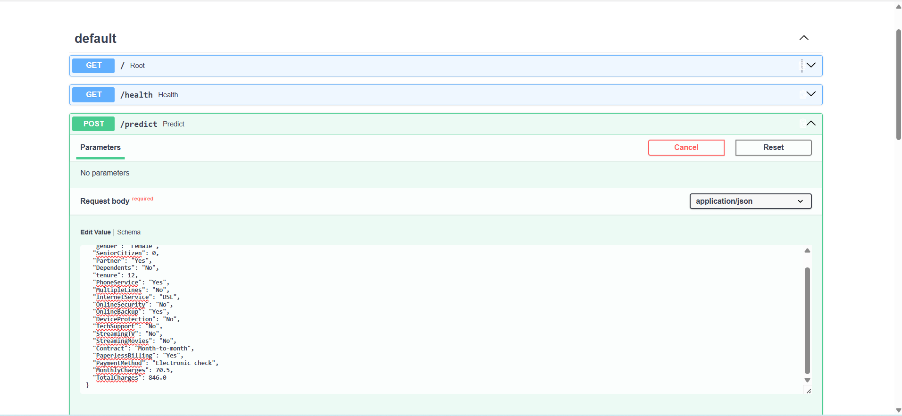
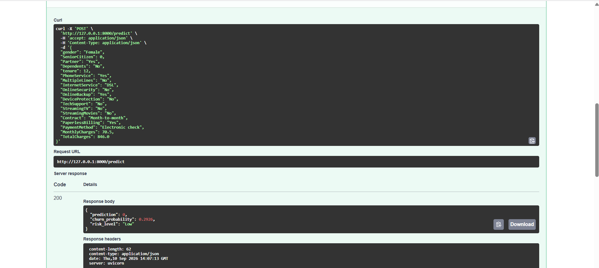

# Customer Churn Prediction System

An end-to-end machine learning system that predicts whether a telecom customer is likely to churn.

The project covers the complete machine learning workflow:

- Data collection
- Data cleaning
- Exploratory data analysis
- Data preprocessing
- Model training
- Model evaluation
- Model saving with Joblib
- Customer prediction
- Streamlit deployment
- FastAPI deployment
- API testing

## Tech Stack

- Python
- pandas
- NumPy
- scikit-learn
- Matplotlib
- Seaborn
- Joblib
- Streamlit
- FastAPI
- Uvicorn
- Pydantic
- pytest

## Project Overview

This project uses the IBM Telco Customer Churn dataset to build a machine learning classification system that predicts whether a customer is likely to leave a telecom service.

The project follows a complete machine learning pipeline, from preparing the raw dataset to deploying the trained model as both a Streamlit application and a FastAPI service.

## Problem Definition

Customer churn is a binary classification problem:

- `0` = customer stays
- `1` = customer churns

The goal is to identify customers who are more likely to churn and provide a churn probability and risk level.

## Dataset

This project uses the IBM Telco Customer Churn CSV dataset.

The project does not generate fake customer records.

Place the downloaded CSV here:

`data/raw/WA_Fn-UseC_-Telco-Customer-Churn.csv`

The dataset contains customer demographic information, services, contract details, billing information, tenure, and charges.

## Features

The model uses customer attributes after removing `customerID`, including:

- Gender
- Senior Citizen
- Partner
- Dependents
- Tenure
- Phone Service
- Multiple Lines
- Internet Service
- Online Security
- Online Backup
- Device Protection
- Tech Support
- Streaming TV
- Streaming Movies
- Contract
- Paperless Billing
- Payment Method
- Monthly Charges
- Total Charges

The target variable is `Churn`.

## Data Preprocessing

The preprocessing pipeline includes:

- Removing duplicate rows
- Dropping `customerID`
- Converting `TotalCharges` to numeric values
- Handling missing values
- Converting `Churn` from `Yes/No` to `1/0`
- Applying median imputation and `StandardScaler` to numerical features
- Applying most-frequent imputation and `OneHotEncoder` to categorical features

All preprocessing steps are included in the same scikit-learn pipeline as the model. This ensures that the same transformations are used during both training and prediction.

## Exploratory Data Analysis

The project includes an EDA notebook:

`notebooks/01_eda.ipynb`

The notebook is used to explore the dataset, understand customer characteristics, and visualize patterns related to churn.

## Models

Three machine learning models were trained and compared:

- Logistic Regression
- Decision Tree
- Random Forest

The models were evaluated using:

- Accuracy
- Precision
- Recall
- F1-score
- ROC-AUC
- Confusion Matrix

The best model was selected primarily based on F1-score, with ROC-AUC used as a tie-breaker.

## Model Performance

| Model | Accuracy | Precision | Recall | F1-score | ROC-AUC |
|---|---:|---:|---:|---:|---:|
| Logistic Regression | 80.55% | 65.72% | 55.88% | 60.40% | 84.19% |
| Decision Tree | 79.84% | 63.47% | 56.68% | 59.89% | 83.03% |
| Random Forest | 77.86% | 60.62% | 47.33% | 53.15% | 81.71% |

### Best Model

Logistic Regression achieved the best overall performance and was selected as the final model.

## Model Saving

The complete preprocessing and model pipeline is saved using Joblib:

`models/churn_model.joblib`

This saved pipeline can later be loaded and used to make predictions on new customer data.

## Project Structure

```text
customer-churn-ai/
│
├── api/
│   ├── __init__.py
│   └── main.py
│
├── app/
│   ├── __init__.py
│   └── streamlit_app.py
│
├── data/
│   └── raw/
│       └── WA_Fn-UseC_-Telco-Customer-Churn.csv
│
├── models/
│   └── churn_model.joblib
│
├── notebooks/
│   └── 01_eda.ipynb
│
├── src/
│   ├── __init__.py
│   ├── data_collection.py
│   ├── preprocessing.py
│   ├── predict.py
│   └── train.py
│
├── tests/
│   ├── __init__.py
│   └── test_api.py
│
├── .gitignore
├── README.md
└── requirements.txt
```

The dataset and trained model are kept locally and may be excluded from the GitHub repository using `.gitignore`.

## Installation - Windows PowerShell

Create and activate a virtual environment:

```powershell
python -m venv .venv
.venv\Scripts\Activate.ps1
```

Install the required packages:

```powershell
pip install -r requirements.txt
```

If PowerShell blocks virtual environment activation, you can run the project using:

```powershell
.venv\Scripts\python.exe
```

## Data Collection / Check

After placing the dataset in the correct location, run:

```powershell
python src/data_collection.py
```

This checks that the dataset is available and ready for processing.

## Train the Model

Run:

```powershell
python src/train.py
```

The training script:

1. Loads the dataset
2. Cleans the data
3. Preprocesses the features
4. Splits the data into training and testing sets
5. Trains multiple models
6. Evaluates the models
7. Selects the best model
8. Saves the final pipeline using Joblib

The trained model is saved to:

`models/churn_model.joblib`

## Run the Streamlit Application

Start the Streamlit application with:

```powershell
python -m streamlit run app/streamlit_app.py
```

The application allows the user to enter customer information and receive:

- Churn prediction
- Churn probability
- Risk level

## Run the FastAPI Application

Start the API with:

```powershell
python -m uvicorn api.main:app --reload
```

The API will run locally and provide interactive documentation through Swagger UI.

Open:

`http://127.0.0.1:8000/docs`

## API Endpoints

### GET `/`

Returns basic information about the API.

### GET `/health`

Checks whether the API is running.

### POST `/predict`

Receives customer information and returns a churn prediction.

Example response:

```json
{
  "prediction": 0,
  "churn_probability": 0.2926,
  "risk_level": "Low"
}
```

## Example API Request

POST `/predict` with:

```json
{
  "gender": "Female",
  "SeniorCitizen": 0,
  "Partner": "Yes",
  "Dependents": "No",
  "tenure": 12,
  "PhoneService": "Yes",
  "MultipleLines": "No",
  "InternetService": "DSL",
  "OnlineSecurity": "No",
  "OnlineBackup": "Yes",
  "DeviceProtection": "No",
  "TechSupport": "No",
  "StreamingTV": "No",
  "StreamingMovies": "No",
  "Contract": "Month-to-month",
  "PaperlessBilling": "Yes",
  "PaymentMethod": "Electronic check",
  "MonthlyCharges": 70.5,
  "TotalCharges": 846.0
}
```

Example response:

```json
{
  "prediction": 0,
  "churn_probability": 0.2926,
  "risk_level": "Low"
}
```

The prediction and probability are generated by the trained Logistic Regression pipeline.

## API Testing

The project includes automated API tests using pytest.

Run:

```powershell
python -m pytest
```

The tests cover:

- API root endpoint
- Health endpoint
- Prediction endpoint
- Invalid input

Current test result:

```text
4 passed
```

## Deployment

The project provides two local deployment interfaces:

### Streamlit

Used to provide a simple interactive interface for customer churn prediction.

### FastAPI

Used to provide a REST API that can receive customer information and return predictions programmatically.
## Application Screenshots

### Streamlit Application

The Streamlit interface allows users to enter customer information and receive a churn prediction.



### Streamlit Prediction Result

The application displays the predicted churn status, churn probability, and risk level.



### FastAPI Swagger UI

The FastAPI service provides an API for sending customer information and receiving predictions.




## Future Improvements

Possible improvements for future versions include:

- Hyperparameter tuning
- Class imbalance handling
- Feature importance analysis
- Model explainability
- Docker deployment
- Cloud deployment
- CI/CD integration
- Monitoring model performance over time

## Author

Built as a machine learning project demonstrating an end-to-end workflow from data preparation to model deployment.
